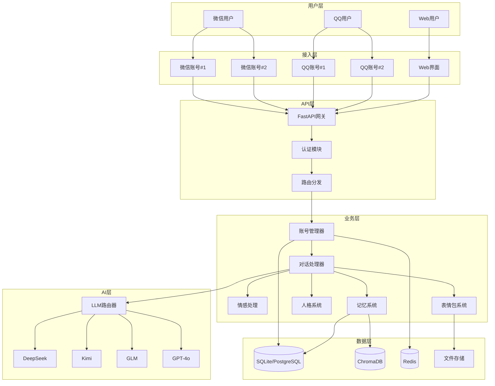
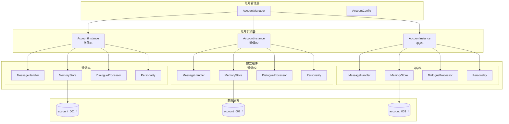
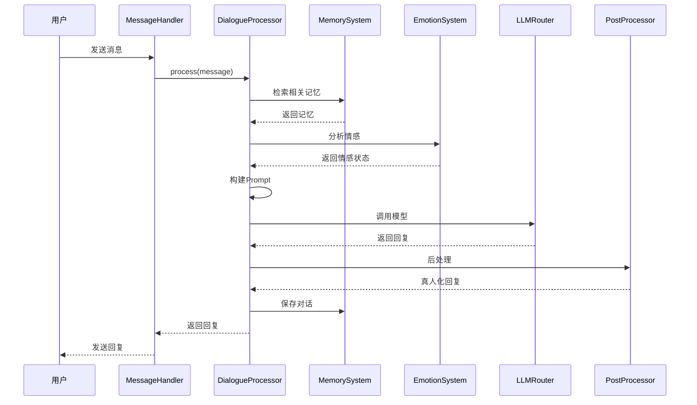
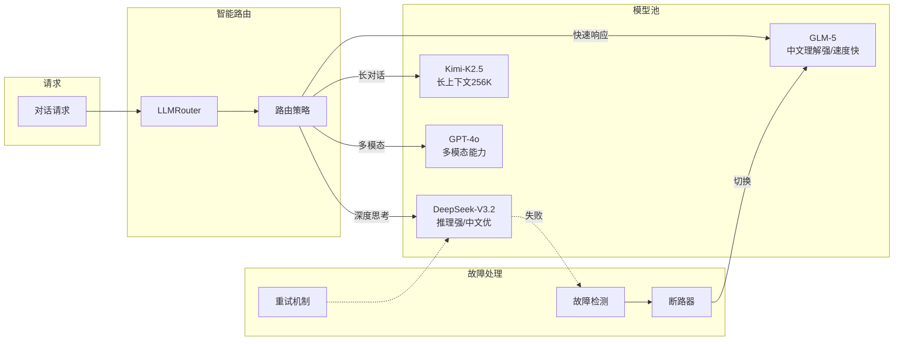
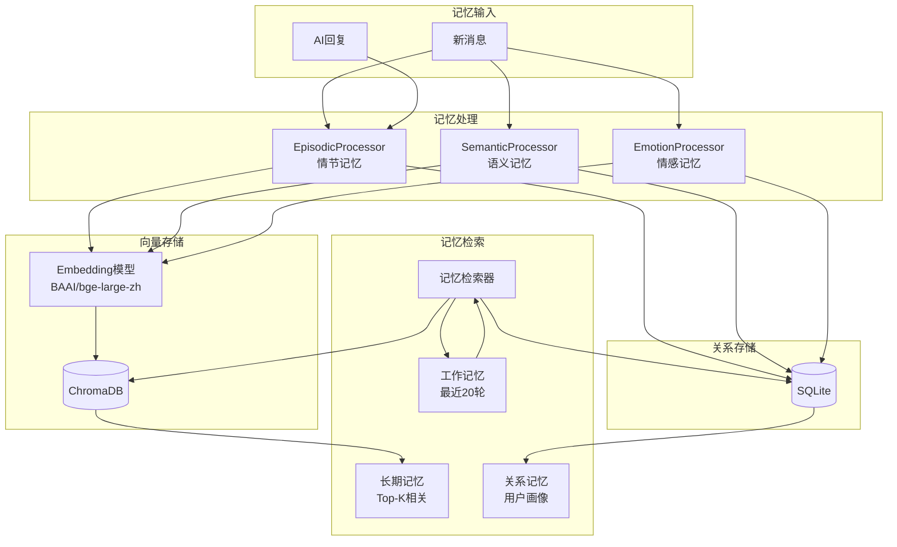
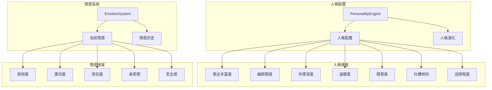
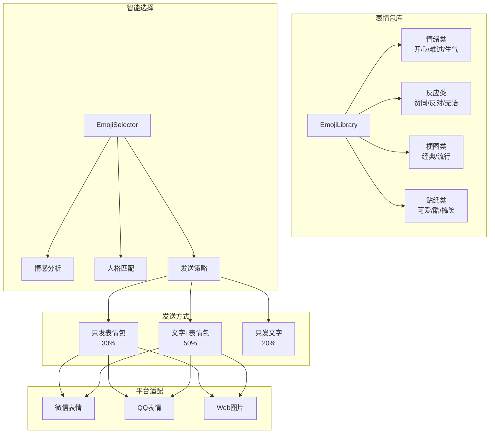
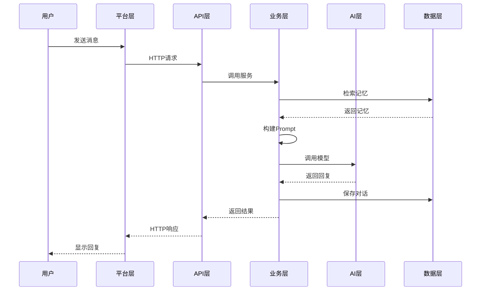
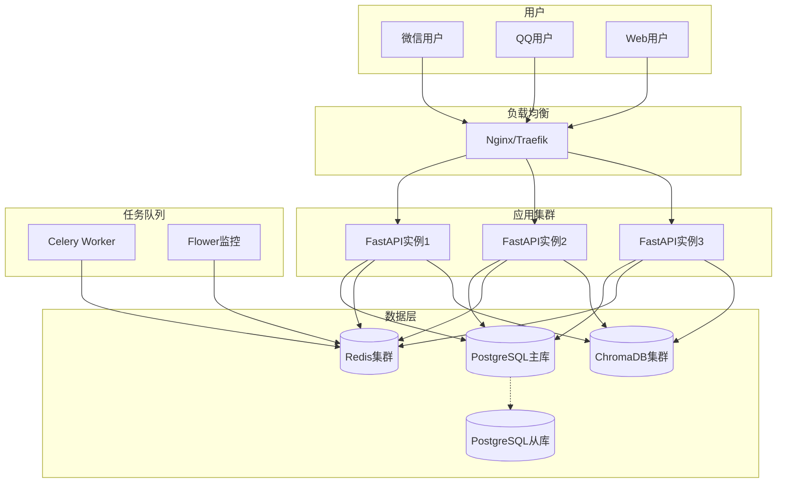

# AI小花系统架构图

## 1. 整体架构图

## 2. 账号管理架构

## 3. 对话处理流程

## 4. 多模型路由架构

## 5. 记忆系统架构

## 6. 人格与情感系统

## 7. 表情包系统架构

## 8. 技术栈

| 层级 | 技术 | 说明 |
|------|------|------|
| **后端框架** | FastAPI | 高性能异步Web框架 |
| **数据库** | SQLAlchemy + SQLite/PostgreSQL | ORM + 关系数据库 |
| **向量数据库** | ChromaDB | 向量相似度搜索 |
| **缓存** | Redis | 会话缓存、任务队列 |
| **任务队列** | Celery | 异步任务处理 |
| **AI模型** | DeepSeek/Kimi/GLM/GPT-4o | 大语言模型API |
| **嵌入模型** | BAAI/bge-large-zh-v1.5 | 中文文本嵌入 |
| **部署** | Docker + Docker Compose | 容器化部署 |
| **代码质量** | Black + isort + flake8 + mypy | 代码格式化和类型检查 |

## 9. 数据流图

## 10. 部署架构

---

这些架构图展示了AI小花的完整技术架构，包括多账号管理、智能路由、记忆系统、人格情感、表情包回复等核心功能的设计。